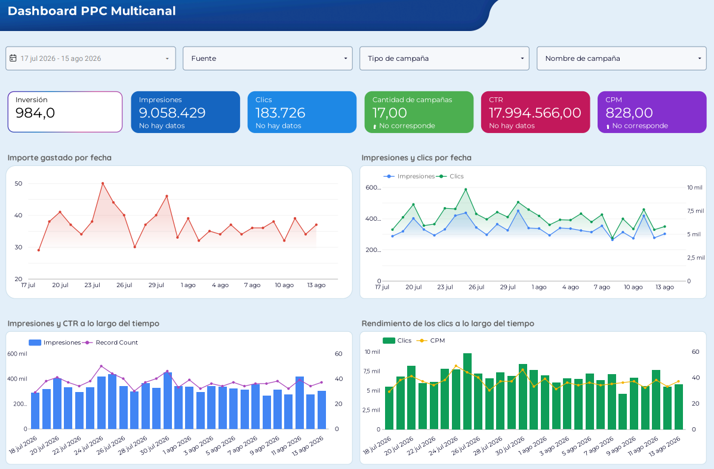
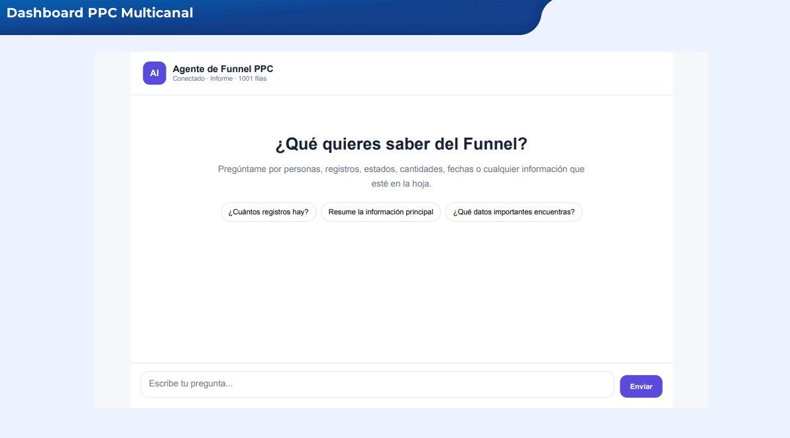

# Dashboard PPC Multicanal — LookML package

## Contenido

- `models/ppc_multicanal.model.lkml` — modelo principal.
- `views/ppc_multicanal.view.lkml` — campos, dimensiones y métricas inferidos.
- `dashboards/ppc_multicanal.dashboard.lookml` — dashboard con las páginas/secciones
  visibles en las capturas.
- `images/` — capturas originales entregadas.
- `sql/` — espacio para la consulta o vista SQL real de origen.
- `manifest.lkml` — configuración básica del proyecto.

## Campos observados

Filtros:
- Fecha
- Fuente
- Tipo de campaña
- Nombre de campaña

Métricas:
- Inversión
- Impresiones
- Clics
- Cantidad de campañas
- CTR
- CPM
- Record Count

Dimensiones:
- Fuente
- Tipo de campaña
- Nombre de campaña
- Fecha

Fuentes/canales visibles:
- Google Ads
- Facebook Ads
- LinkedIn Ads
- Twitter Ads
- TikTok Ads
- Instagram Ads
- Quora Ads
- Bing Ads

